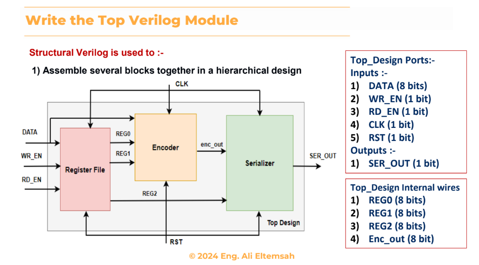

Structural Verilog Top Module

This repository contains a simple structural Verilog exercise where a top-level module (`Top_Module`) is created by instantiating three submodules:
1. Register File  
2. Encoder  
3. Serializer  

The goal is to practice hierarchical design in Verilog by wiring submodules together, without implementing their internal logic.

Contents
- Top_Module.v: The top-level Verilog file (structural only, submodules not implemented).  
- Top_Module_Block_Diagram.png: Block diagram showing how the modules are connected (credit below).  

Block Diagram

*Block diagram © 2024 Eng. Ali Eltemsah*  

Notes
- This project is educational and not intended for synthesis as is.  
- The submodules (`REG_FILE`, `ENCODER`, `SERIALIZER`) are placeholders.  
- Connections strictly follow the provided block diagram.  

Special credit to **Eng. Ali Eltemsah (© 2024)** for the block diagram used in this exercise.  
